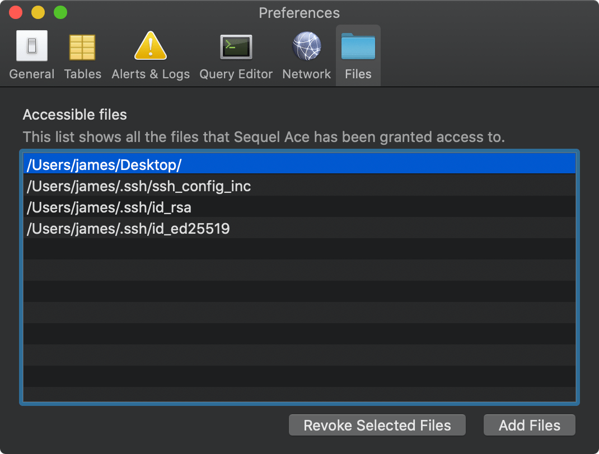
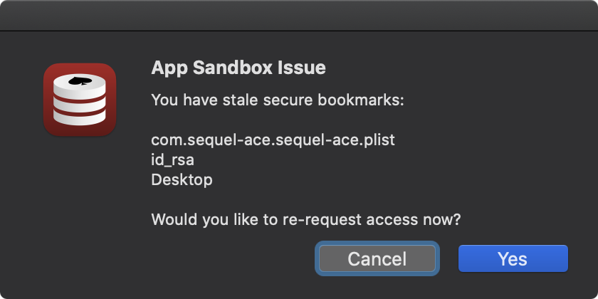
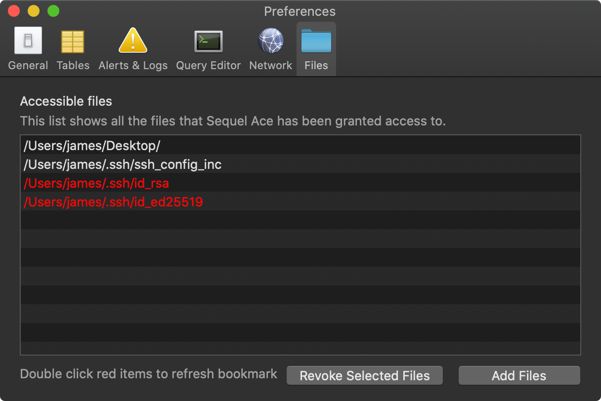

- [Getting Connected](get-started/)
- [Making Queries](queries.html)
- [Keyboard Shortcuts](shortcuts.html)
- [Reference](ref/)
- [Bundles](bundles/)
- [Contribute](contribute/)

### A Quick Introduction To App Sandbox

[App Sandbox](https://developer.apple.com/library/archive/documentation/Security/Conceptual/AppSandboxDesignGuide/AboutAppSandbox/AboutAppSandbox.html#//apple_ref/doc/uid/TP40011183-CH1-SW1) is an access control technology provided in macOS, enforced at the kernel level. It is designed to contain damage to the system and the user’s data if an app becomes compromised. Apps distributed through the Mac App Store must adopt App Sandbox.

Sequel Ace is distributed through the Mac App Store, therefore Sequel Ace adopts App Sandbox for your safety and peace of mind.

App Sandbox is based on a basic principles: any resource the app requires must be requested and the user must allow or deny access. The app must define the resources it requires in an entitlements file.

**Access to any resource not explicitly requested in the entitlements file is rejected by the system at run time.**

Sequel Ace requests the following entitlements[^fn-entitlements]:

| Entitlement key                                  | Description     |
| :------------------------------------------------| :-------------- |
| com.apple.security.app-sandbox                   | Enables App Sandbox |
| com.apple.security.network.server                | Allow Incoming Connections |
| com.apple.security.network.client                | Allow Outgoing Connections |
| com.apple.security.files.user-selected.read-write| Read/write access to files the user has selected using an Open or Save dialog |
| com.apple.security.files.bookmarks.app-scope     | Use of app-scoped bookmarks and URLs |

It's the last entitlement that we are interested in here.

### Security-Scoped Bookmark and URL Access

From [Apple](https://developer.apple.com/library/archive/documentation/Miscellaneous/Reference/EntitlementKeyReference/Chapters/EnablingAppSandbox.html#//apple_ref/doc/uid/TP40011195-CH4-SW18):

> If you want to provide your sandboxed app with persistent access to file system resources, you must enable security-scoped bookmark and URL access.

In plain English, to prevent Sequel Ace from having to re-request access to files a user has already granted access to, we use security-scoped bookmarks to save the permission granted by the user, for subsequent launches of the app.

__In short: with the app-scoped bookmark, Sequel Ace can obtain future access to the file/folder without bothering the user again.__

Note: we provide a mechanism for a user to revoke access to a file/folder in __Preferences->Files__. You can also see all the files that have a security-scoped bookmark on the same screen:

### Stale Security-Scoped Bookmarks

When Sequel Ace starts up, it loads the list of security-scoped bookmarks and checks each bookmark is still valid and not 'stale'.

A bookmark might become 'stale' for a number of reasons[^fn-stale-reasons], including:

- The app hasn't been used in many months.
- macOS has been upgraded.
- The app was re-installed.
- The app's preferences .plist file was deleted.
- The file pointed to by the bookmark was updated _and_ moved.

If Sequel Ace detects stale bookmarks, you will see this warning when the app starts:

If you want to allow Sequel Ace to access the stale locations, you need to click "Yes" and double-click the red items in the __Preferences->Files__ pane:

If you don't Sequel Ace will not be able to read the stale files.

***

[^fn-entitlements]: You can check these yourself by opening [Terminal](https://en.wikipedia.org/wiki/Terminal_(macOS)) and running: `codesign -d --entitlements :- /Applications/Sequel\ Ace.app/`.
[^fn-stale-reasons]: There could be other reasons. Bookmarks are [complex](https://michaellynn.github.io/2015/10/24/apples-bookmarkdata-exposed/).
